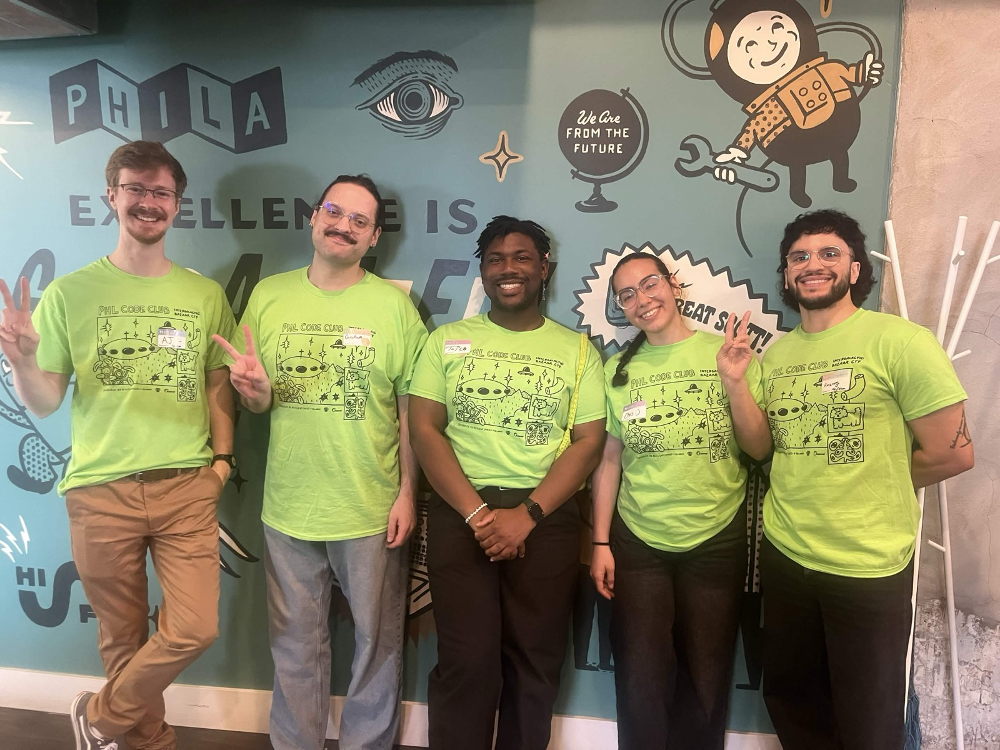
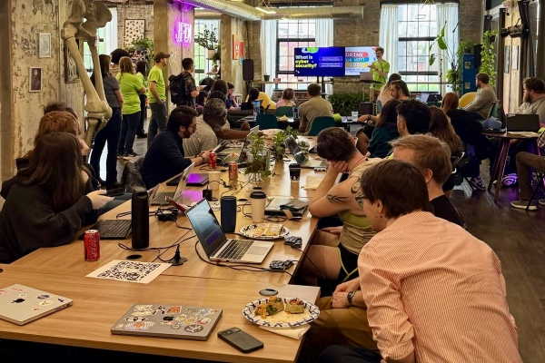
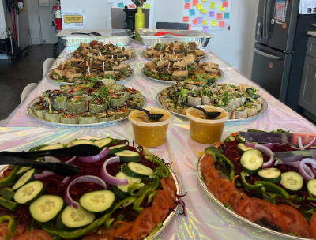
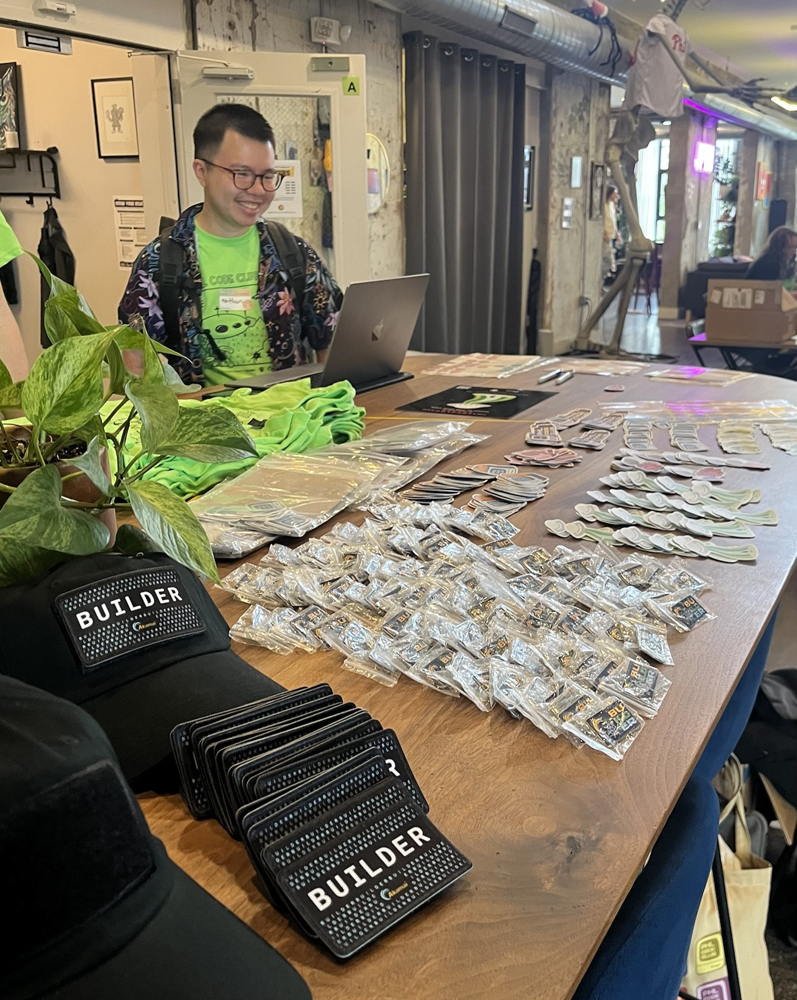
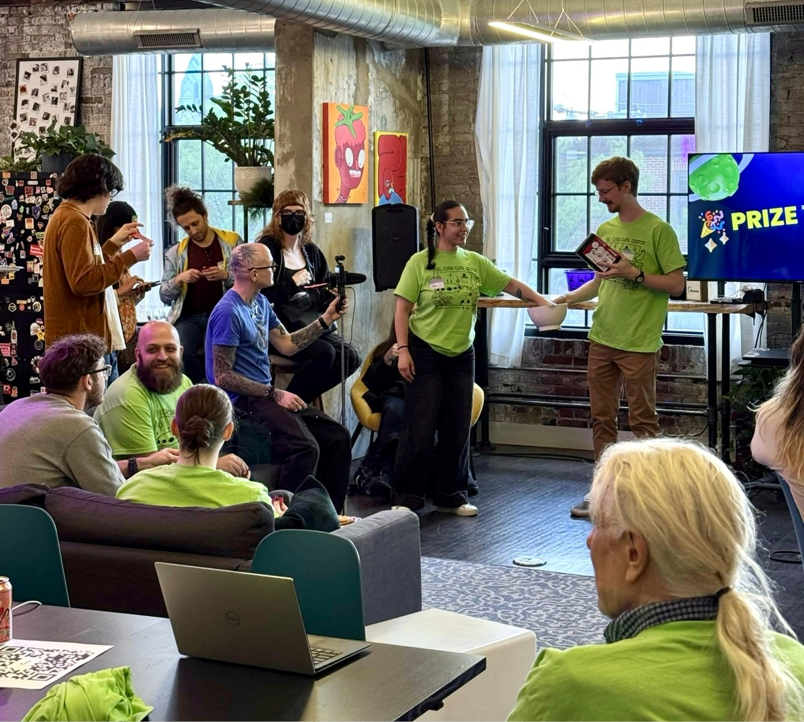
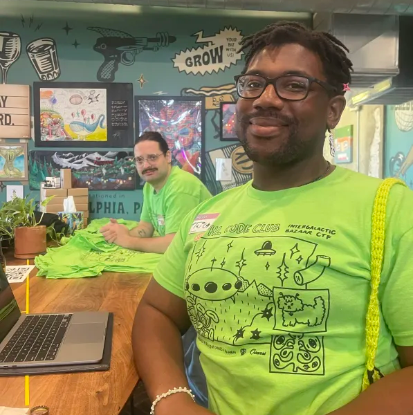
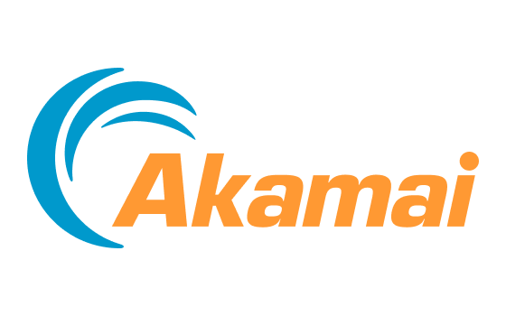
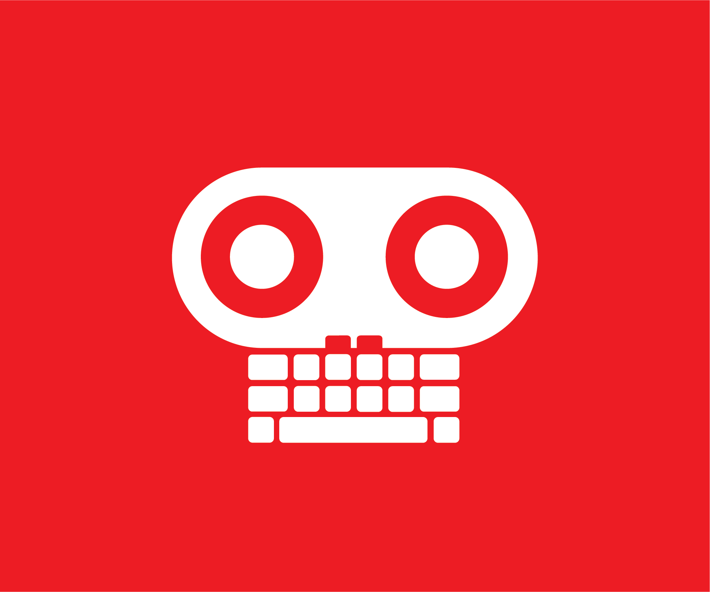

<h2>An Intergalatic Bazaar CTF, Philly Tech Week, & One year of PHL Code Club</h2>

If you had asked me a couple years ago while attending Philly Tech Week if I
could imagine the idea of **hosting** an event for the occasion, I honestly would’ve
laughed, like who? me? Amongst the likes of PhillyCHI, PhillyJS, and Diversitech (all awesome organizations)?...

Fast forward to May 9th 2026 and PHL Code Club has hosted its largest
event yet with 50 people in the building (thank you to [IndyHall](https://indyhall.org/) for allowing
four nerds to rent out the space for a whole day).

I'm seriously blessed to be able to actualize this with three of my best friends. A huge thank you to Graham for always encouraging us to think bigger and push the boundaries of what is possible for code club.

Coordinating the CTF was no small feat as [Taj](/organizers/taj) puts it,

> "Our planning usually consist of some pizzas, stickers and the activity itself.
> This event brought on a new meaning to the term: logistics.
> From food, to drinks, to coffee and snacks - I was reminded a bit of my childhood spent at my grandparents table planning for the next family event or stocking up the business. Even a trip to Costco was warranted (this is groundbreaking for a city slicker like myself) .
> Jokes aside, the payoff of feeding 50 people and providing a comfortable space for them to connect and learn was well worth it. "

Yes you heard that correctly. We had food, drinks, snacks, prizes, and plenty of swag. From performing balancing acts with
trays of 60+ sandwiches to driving across the Ben Franklin Bridge for discounted Costco goods, the team really came
together to pull this off. Our efforts were
evident the day of the CTF. Everything ran so smoothly, we were all a bit surprised.
Not even the common HDMI hiccup during presentation.

To create a space where people can relax, learn, make new friends, and be rewarded for their efforts - It’s hard
to put into words the high you get seeing it all unfold. It’s magical. The sentiment from the community echoed our feel good feelings post CTF. Knowing how much they relished in the festivities and playing along with our whimsical themes means the world to us. It informs us that we are doing something right.

In [Graham’s](/organizers/graham) words,

> "We had such a great mix of familiar and new faces. I’ve also heard so much
> super positive feedback. It seems like people are hungry for these interactive
> non-standard events, and we plan to continue cooking for them!"

The icing on the cake was the fact it also served as our one year mile stone of Code Clubbing. Which means we've officially hosted 12 code club events, 6+ socials, participated as a key meetup group for The Big Philly Meetup MashUp, spoke at our first tech conference, built a community of over 150 peeps over on Discord, and achieved 300+ Luma subscribers. I can't wait to see what the next year brings our way. (っᵔ◡ᵔ)っ

We’re seriously thankful for everyone who came together to make this happen. In no particular order:

- Alex Hillman
  - Allowing us to host at Indy Hall was huge, and your guidance and advice was
    amazing!
- AJ
  - Our Cybersecurity rockstar for the day, your knowledge, and ideas were so helpful
- Inessa
  - The creative genius behind the wonderful art of the Bazaar (And of course Geraldine)
- Ruckus
  - Getting the support from Akamai was already awesome, but you went above and
    beyond to bring this to life.
- All of our wonderful volunteers

And of course thank you to our sponsors:

Akamai

Resilient Coders

<!-- TODO: Add logo -->

XoXo,

Christina
