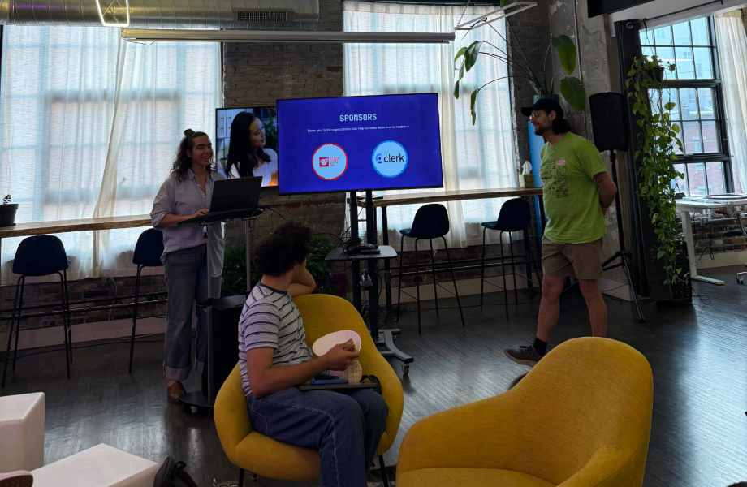
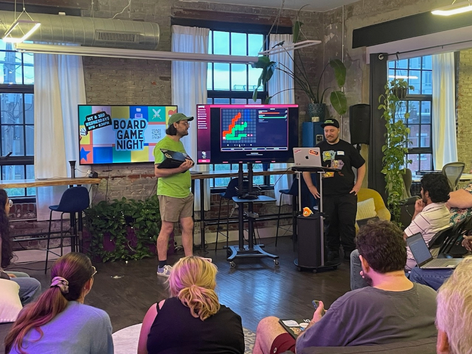
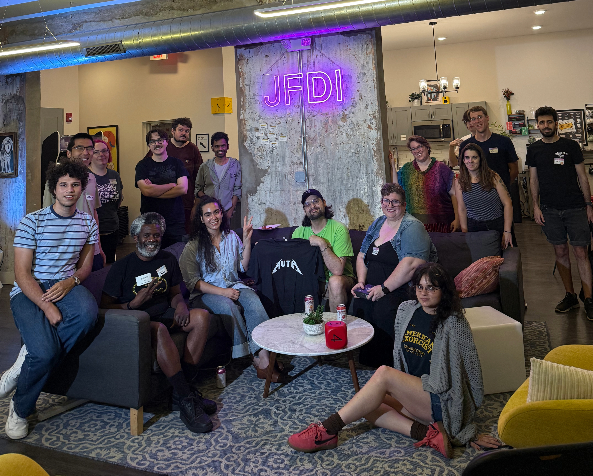
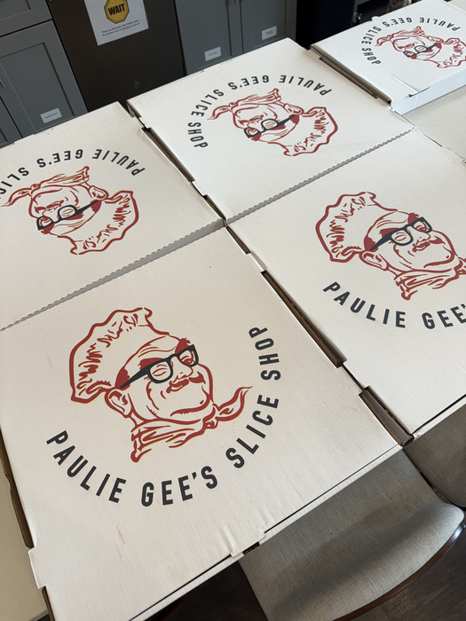
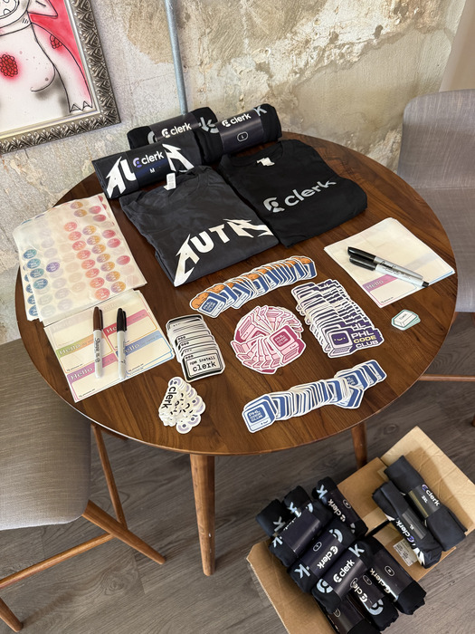

# July Recap

The month of July was another packed month with two events hosted at Indy Hall and a social gathering at one of our favorite spots, Solar Myth.

## Let the best algorithm win, battlesnakes

For our first event, we collaborated with [BreakPoint Live!](https://luma.com/d1e8lz4d?tk=4l2pnH) for a competitive fun night. With prizes including the cute [Snake Py](https://itemlabel.com/products/snakepy) and a Sentry t-shirt, our attendees let their algorithms do the talking and battled it out over a friendly game of [BattleSnake](https://docs.battlesnake.com/). This was super fun and intense watching some of these snakes go for 1000+ turns.

## Back to Solar Myth

The following week we had our **Social Hour**. We brought it back to Solar Myth and its more intimate setting, where we yapped and bonded over cocktails and chai. We appreciate those who came out to connect beyond the keyboard.

## Hack n Hanging

For our “main event” AKA our designated third Thursday of the month, we provided space for a community favorite, Hack n Hang. Folks came out to work on projects, play games, and chill. We got a fun (and surprisingly long) round of Flux in. A fun card game where the rules and objective of the game change as you go. There was a special card called “Little Groot”, the rule being that the holder of the card had to say nothing but “I am Groot” for as long as the player had the card in hand. Easier said than done lol.

### Gratitude to our Sponsors

We honestly couldn’t do any of this without our sponsors who support us by providing us with a place to host and yummy foods to fill the bellies of our community. Thank you Resilient Coders and Clerk 😀

Speaking of Clerk, we finally got some cool merch to give out to everyone, including stickers, t-shirts, and baseball caps <.< So come out to our next event and get your hands on some swag before it’s all gone!

## What to look forward to in August

- [Neighborhood Nights](https://luma.com/5v7bwst8)
  - Getting together for some afterhours coworking at Indy Hall! 💻

- [Building Powerful CLIs with Go](http://luma.com/rlkwsocd)
  - We’ll have the awesome Ruckus Voxi, Senior Developer Advocate at Akamai, heading this workshop.

- [Social Hour, PHS PopUp](https://luma.com/cf7vc50y)
  - Just a relaxing night of sipping and yapping with our code club friends ☕ 🍷🍻 already at 30+ <.<
