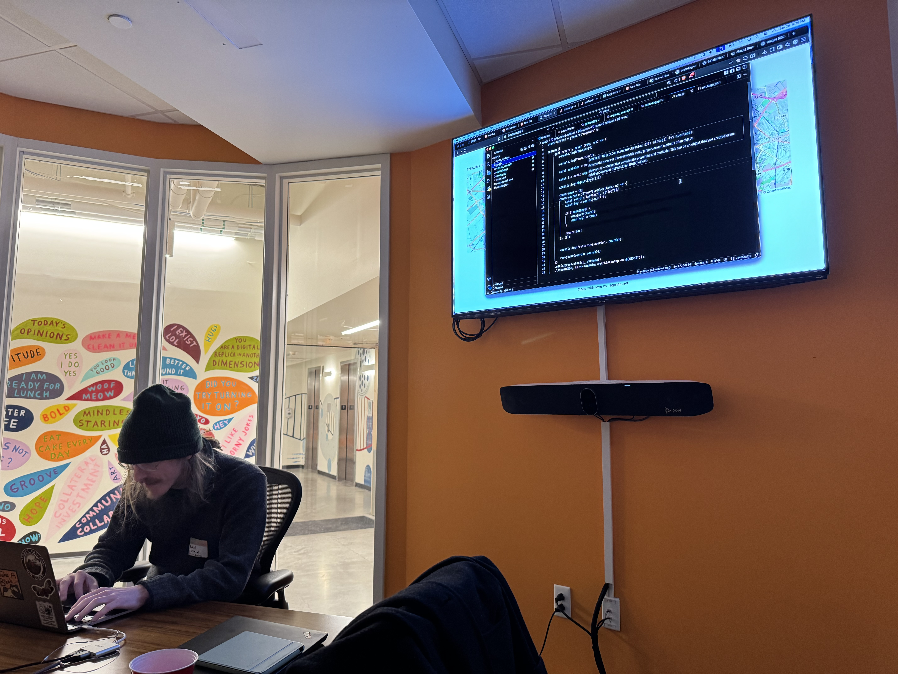
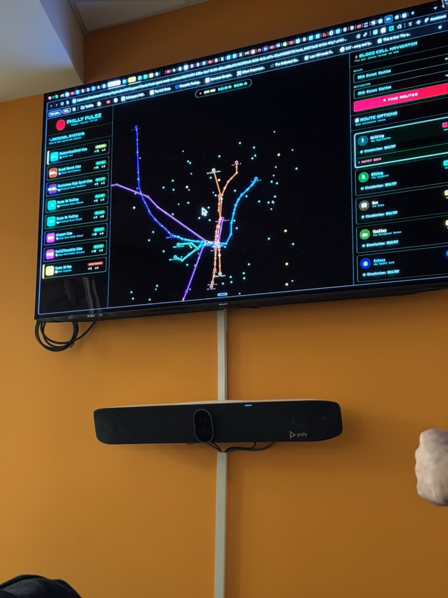
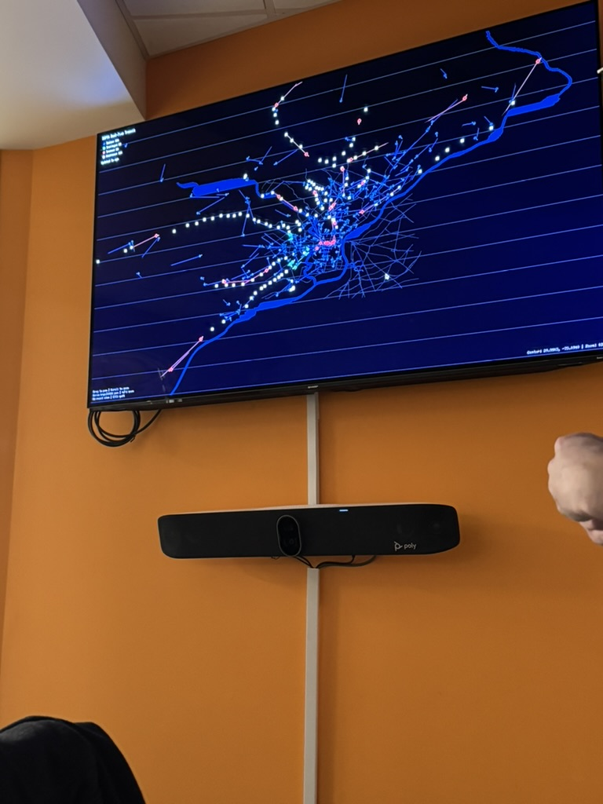
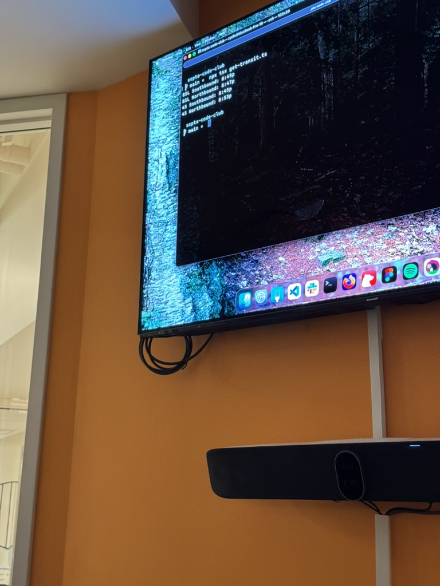
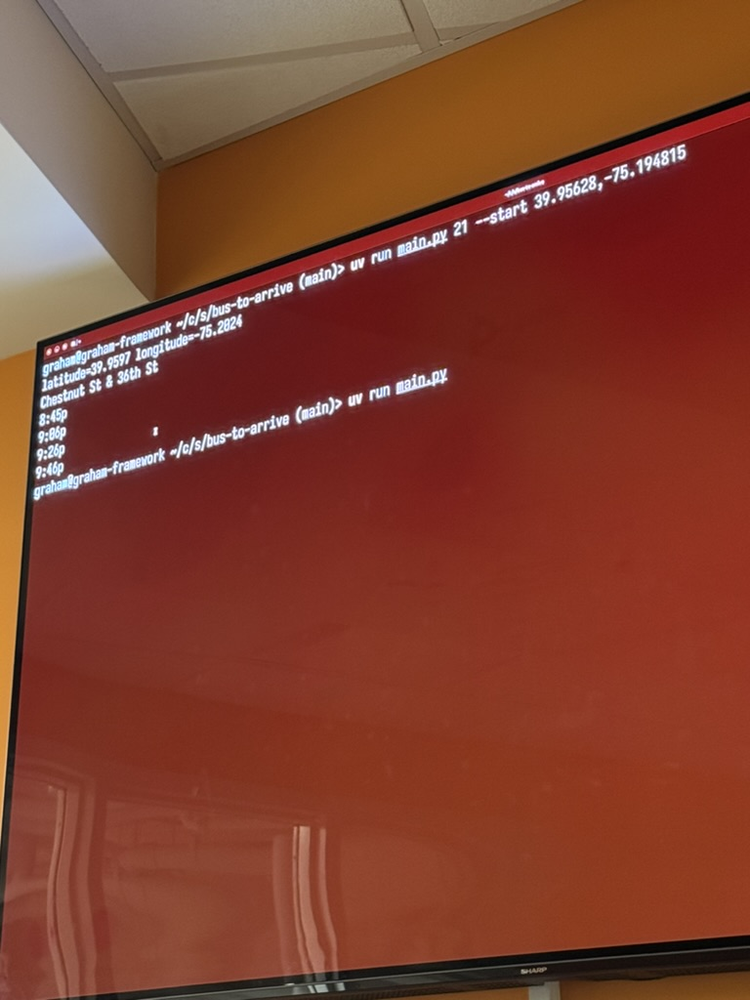
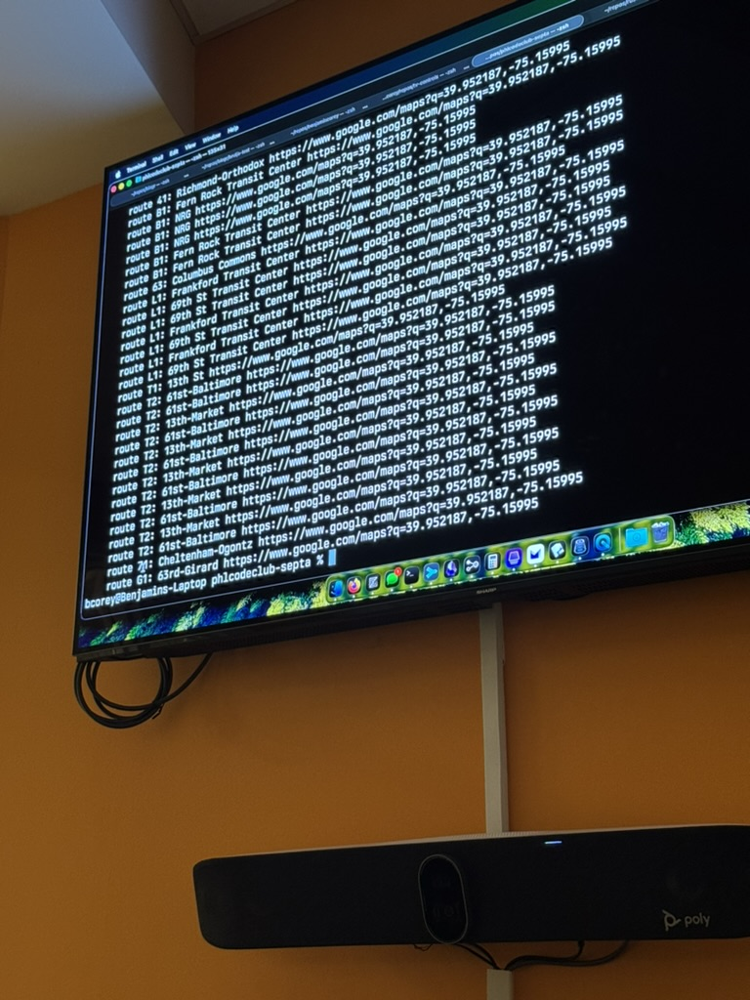
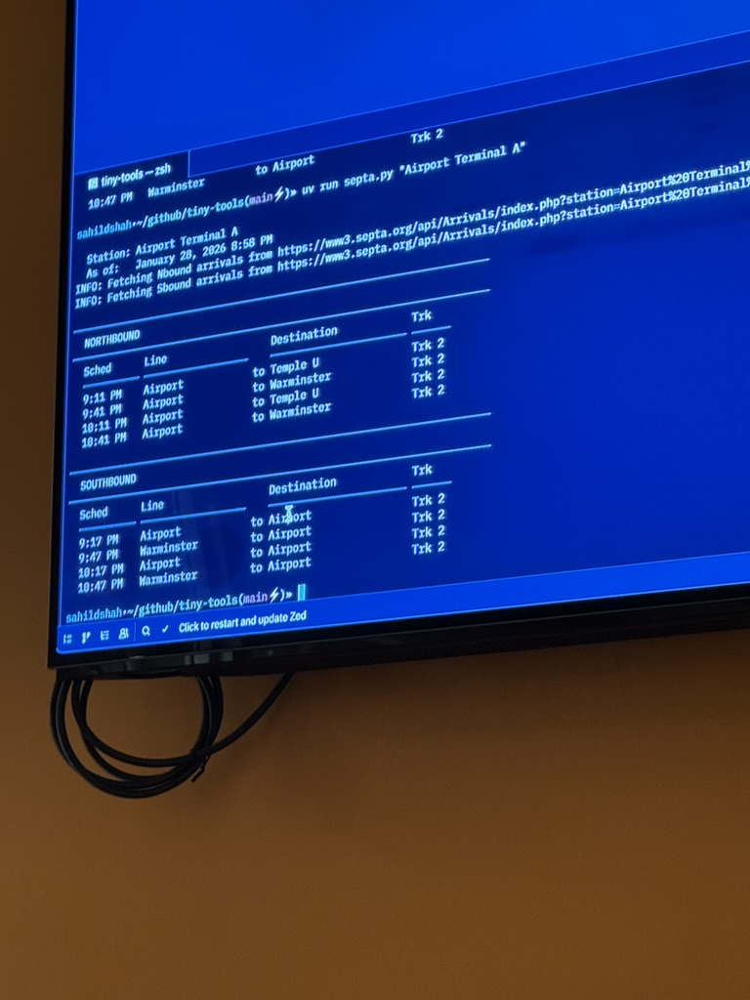
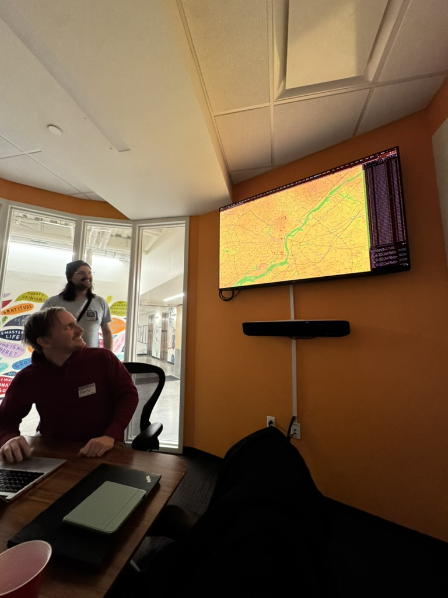
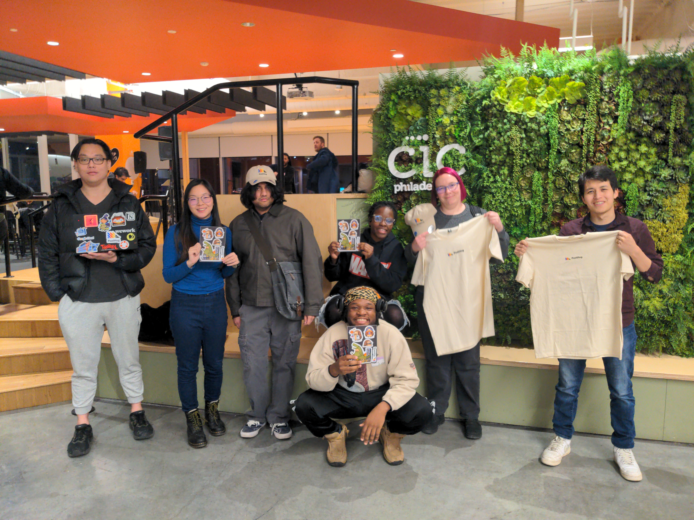

Going to try a new format for today's blog. Announcements, followed by a TLDR, followed by long form. I'm a yapper, so here's your chance to get in and get out.

### ANNOUNCEMENTS

- PHL Code club will be at Indy Hall for the next 3 months, thanks to Supabase!
  - You can register for the next technical event here:[Luma]<https://luma.com/home?e=evt-CTt5U0y9lBAPN9E>.
- We will be doing socials on the first Wednesday of the month. Keep an eye on bluesky and discord for that.
- PHL Code Club is now incorporated!

## TLDR: - Probably whats going on the post hog blog

On January 28th, We did an event called "Let's Build it {period}" . For the event, people were tasked to create something using the Septa API and encouraged to share it at the end. After a little pizza and socializing , we gave users an hour to come up with something - anything! Some people made CLI wrappers, while others went with cool data visualizations. We had around 10 people volunteer to present what they created! (This part was extra cool). Afterwards, we did a raffle for some Post Hog Merch!

## Long(er) form content: OwO

Woo! Another event on the books

Before we get started, a quick thank you to our sponsors: Resilient Coders and PostHog! We appreciate you for the venues, space, food, and - everyone's favorite - merch! To Supabase - we are so grateful for our upcoming residency at Indy Hall. Thank you for providing us with this opportunity!

#### About the event

This one was called, you guessed it, "Let's Build it {period}". In all honesty, Christina and I came up with the name over a few drinks at Solar Myth. LOL
This event was all about getting back to building. We had a great time doing socials at the end of 2025, but we were all starting to miss coding with friends. So we did it!

For this event, we told the group to use the Septa API to build ... something. Literally anything.
To get things started, we provided a few suggestions for projects:
- A small frontend that uses pictures of cats to track buses on a
map
- A cli for fetching current information
-  A chart that shows the average heading of all buses on a route
-  A wrapper API (Like Is SEPTA Fucked? (https://isseptafucked.com/api-docs/)

After the suggestions went up, we gave everyone the option to pair up or code solo. From there, we set a timer to 1 hour and let everyone loose.

When the hour was up we provided time to present projects.

Here are a few quotes and info from those brave enough to present:

  
  
**Richard** - Made an app to tell us if the trolley is on time - and uh, do we actually believe Sept when the api returns yes? Spoiler, no we don't.

**Matt** - Matt told us that he "slop coded something" - and it turned out to be really cool. We all enjoyed looking at the Septa rail network as if it were the nervous system

**Vishnu** - "If you had realtime data but properly visualized".

**Ryelle** - cool terminal program that polls the closest bus to their house

**Graham B (not organizer Graham) & Jessie** - made an app to find the closest buses at current locations

**Ben** - Terminal app that finds both the buses that are furthest away from each other and the two closest to each other. Interestingly, this led to finding what he dubbed the 'Septa party'. That is - 91 buses, trams, and trains coalescing at the reading terminal market! Maybe they know something we don't!

**Sahil** - This one was a terminal program that provide arrivals and departures of buses from specified locations. Notably, everyone agreed it was the tidiest program, he thanked AI for it - I dont recall which model though.

**Zephyr** - Our resident indie web host. He went down the documentation rabbit hole but still manage to pull of the sweet tracker.

We raffled off some awesome merch from PostHog as well. Take a look:

Huge thank you to everyone that came out. <3
Ever grateful,
Taj

P.S. - I was a fan of em dashes before they started getting flagged for AI use!!!!!!
