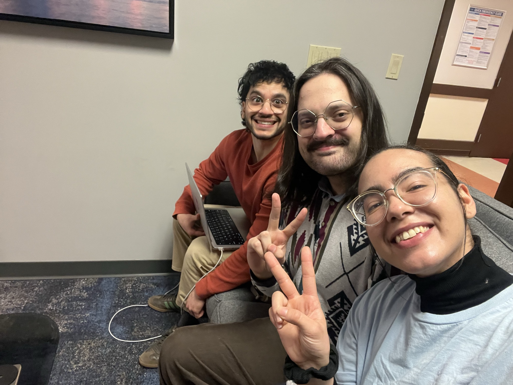
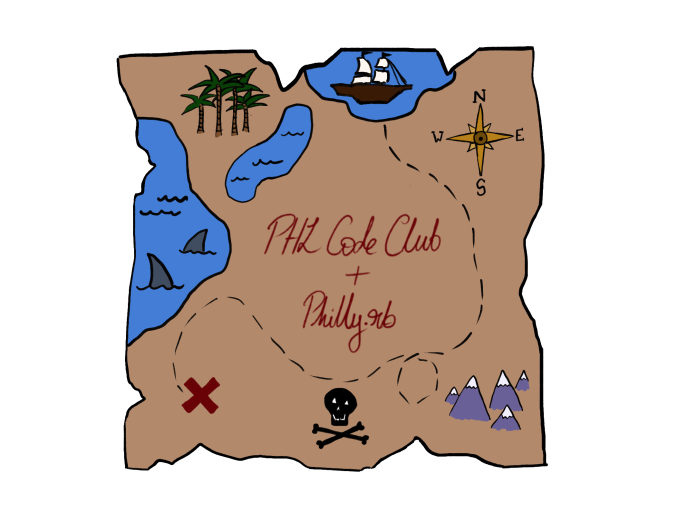
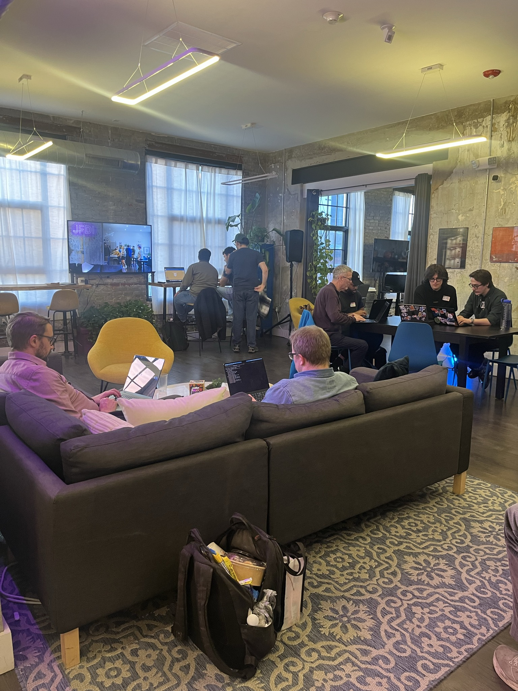
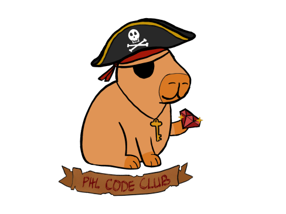

Hey all,

Checking in for an update on the madness that was March.

The PHL Code Club was involved in not 1, not 2, but 3 (4?) events that somehow clustered themselves into the middle of the month. And honestly it was super fun - spoiler alert: Taj(me) was off most of the month.

## Git Together

In True Code Club fashion, we kicked off the month with a social hour at [Solar Myth](https://solarmythbar.com/) - a wine bar/ coffee shop in Philadelphia. No pics from that, but always good to have the community come out and get to know people away from keyboard.

## Diversitech

PHL Code Club made its debut in the conference world through participating in this years [Diversitech](https://diversitech.tribaja.co/) Conference here in Philadelphia. On March 19th, Amaury, Christina, and Graham hopped on stage to deliver a workshop titled: "Logs, Traces, and Metrics, Oh My!" Through this talk, we helped professionals of various levels engage with creating an application for observability using OpenTelemetry.

## Hunting for Gems: Coding Challenges For Treasure Hunters 🏴‍☠️

Finally, for our normal event of the month, we collaborated with [Philly.rb](https://www.phillyrb.org/?utm_source=phlcodeclub) to provide an advent of code style treasure hunt. As per usual, a new event means new swag! We had some awesome designs comissioned (see pirate themed images). 

Posting the luma here cause it was a fun one!
<https://luma.com/lvjw5gri>

## Hackathon

Okay, I missed this one too ˙◠˙. However, I can tell you that our pals at [Indy Hall](https://indyhall.org/) hosted "The Big Philly Meetup Mashup". This was an all day, multi-meetup extravaganza that brought together around 100 Philadlephians (and beyond) for a full day of hacking and hanging. Here's a link to the event page for further info about the event: <https://indyhall.org/goodneighbors/>. Big shoutout to Alex from Indy Hall. He has such an eye for community!

All in all, I am super glad to see the club continue growing and am thankful to our sponsors for helping to make this all happen.

Catch you at the next one!

XoXo,

Taj

