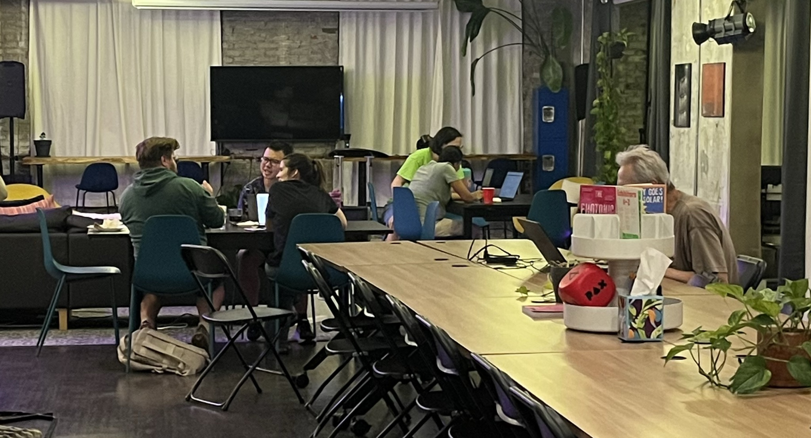

# June Recap

This June was pretty laid back after our trip to the
[Intergalactic Bazaaer](/blog/intergalactic-bazaar). We did a social hour at the
[PHS Pop Up Garden on South St](https://phsonline.org/locations/phs-pop-up-garden-south-street)
and did a workshop setting up the [OpenTelemetry Collector](https://opentelemetry.io/docs/collector/).

We also welcomed a new sponsor... [Clerk](https://clerk.com)! They are an all in
one user management solution, handling things like auth to subscription management.
Huge shout out to Yuri from Clerk for taking the time to hear me out when I
pitched our silly lil group :D

## Social Hour

After getting rained out _twice_, we finally got to spend an evening at the
beautiful PHS Pop Up Garden. Spending time with faces new and old among the
blooming flowers and plants was so much fun.

## OpenTelemetry Workshop

After our survey earlier this year asking our community what types of events they
wanted to see going forward, **workshops** were the clear winner. We decided to
take our learnings from running this workshop at Diversitech (See our post about
[March](/src/blog/march-madness) for more on that), we revamped that workshop to
be a bit more interactive.

Participants built out config for the OpenTelemetry Collector and sent that
telemetry data to local backends in Docker. If you're interested, it is a
self-guided tutorial, you can access it at this [GitHub repo](https://github.com/phl-code-club/otel-workshop/).
Just be sure to read the `tutorial.md` as well as the README 🙃

## Heading into July

Our July has a bunch of fun events!

- [Neighborhood Nights](https://luma.com/d8wfcjrt?tk=MT4OsV)
  - Getting together from some afterhours coworking at Indy Hall! 💻
- [Battle Snake Tournament](https://luma.com/q7gs3hsj)
  - This is one I am particularly excited about! We will be battling our snakes
    to see who is the slitheriest and snakiest 🐍
- [Social Hour at Solar Myth](https://luma.com/yrf9x4f3)
  - Just a relaxing night of sipping and yapping with our code club friends ☕ 🍷🍻
- [Hack 'n' Hang](https://luma.com/g99iodl4)
  - Keeping things laid back after our Battle Snake Tournament, we will get in
    some hack time!
  - Bring your project or just good vibes, I will def be doing some
    [vim gym](https://luma.com/g99iodl4)! ⌨️
