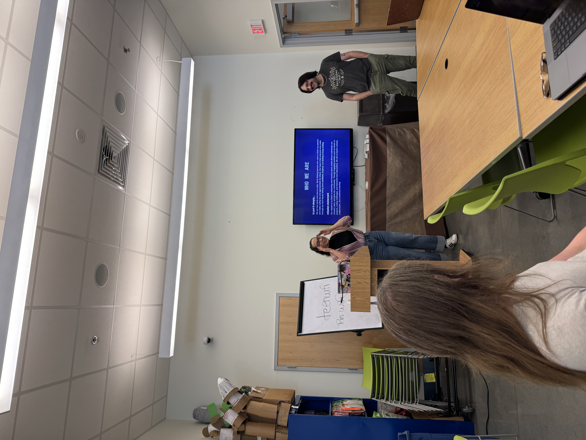
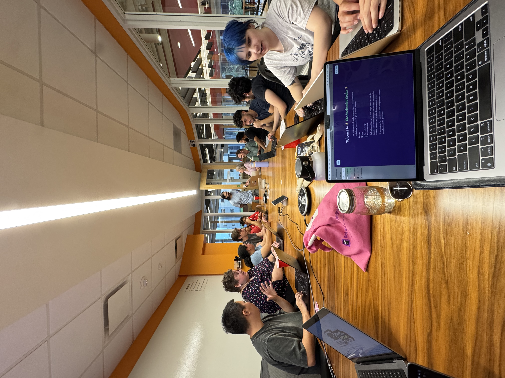
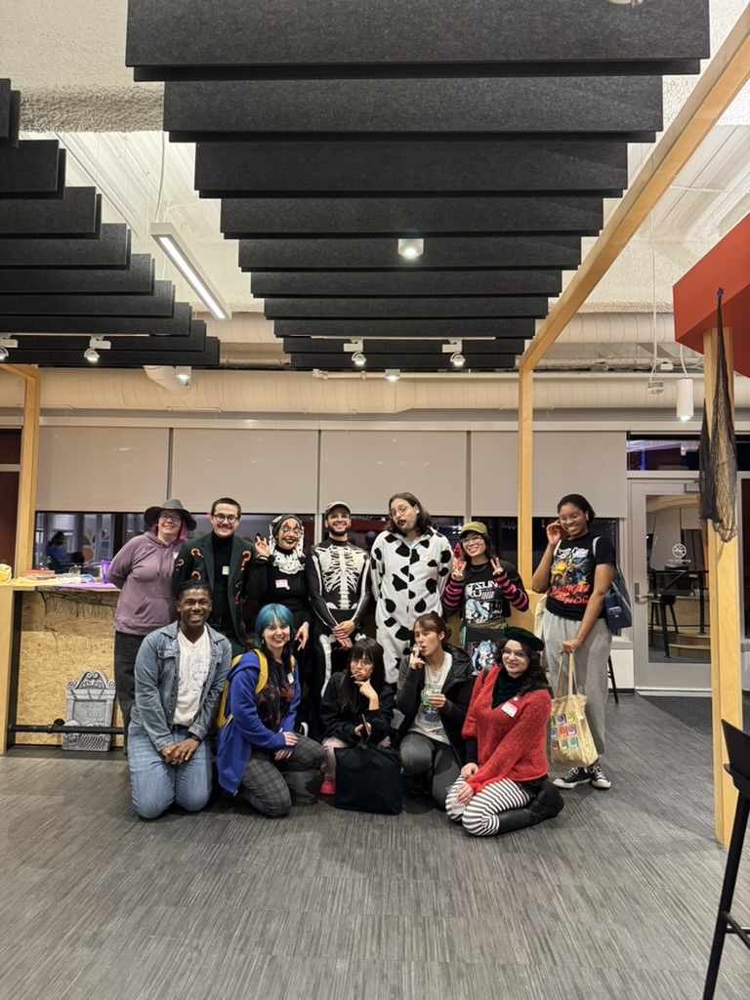
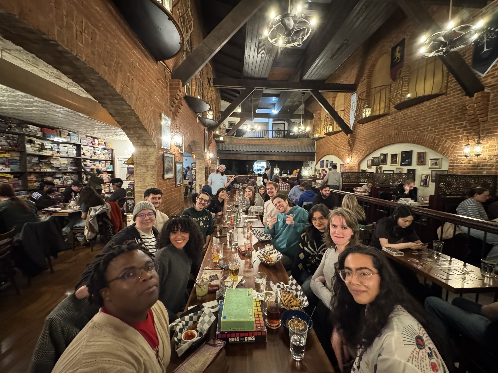

import {Image} from "astro:assets";
import RcLogo from "../assets/resilient.png";
import PhLogo from "../assets/posthog.png";

# HAPPY NEW YEAR

If you're reading this, thanks for checking out the PHL Code Club blog!
We're big on transparency so lemme tell you - this is a bit of a first trial run at blogging. We've got a lot to cover so I'm going to jump right in!

Here today's agenda:

1. [Year in review](#meetups)
2. [Sponsors](#sponsors)
3. [Gratitude](#gratitude)

## Meetups

PHL Code Club set out to do something new in the Philly Scene. To build a community of people that are interested in technology, programming, and computing. People who may enjoy going to talks, but also really want to work on new projects and ideas with their follow nerds - and I think we made incredible progress.

## Sponsors

We've been super fortunate to be supported by Christina and Amaury's coding bootcamp, [Resilient Coders](https://www.resilientcoders.org/)!

We're big believers that opportunities arise when you're doing your passion (and sharing it.) That said, we're also excited to share that [PostHog](https://posthog.com) chose us to be a part of their community builder program!

Can't wait to show you guys all of their cool swag and work with a company that shares our passion for community building.
<a href="https://www.resilientcoders.org/" target="_blank"><Image src={RcLogo} width={100} height={100} alt="Resilient Coders Logo" class="image-reset" /></a>
<a href="https://posthog.com" target="_blank"><Image src={PhLogo} width={100} height={100} alt="PostHog Logo" class="image-reset" /></a>

## Gratitude

Lastly, it's the new year. I want to thank all of our members for an incredible 2025. We had a good year, did some cool presentations, met some cooler people. Let's make 2026 a great one!

xoxo,
Taj

