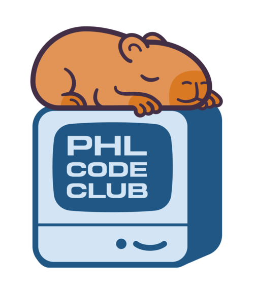
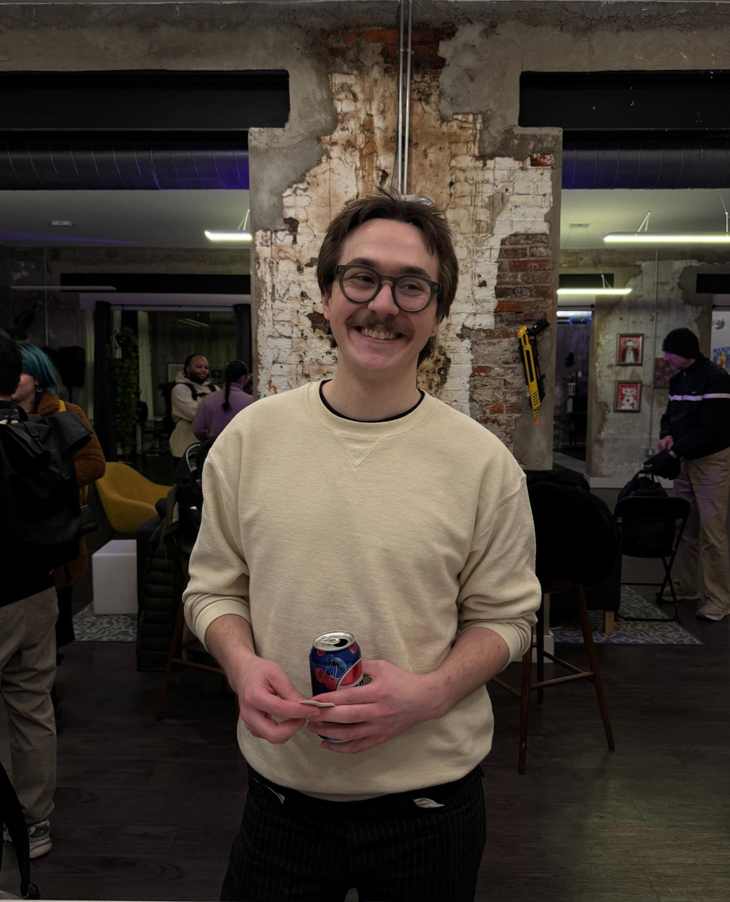
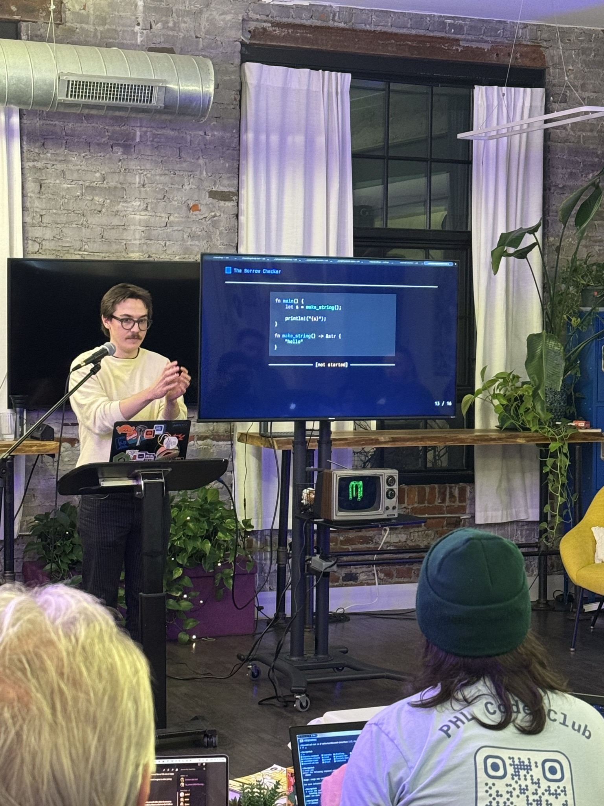
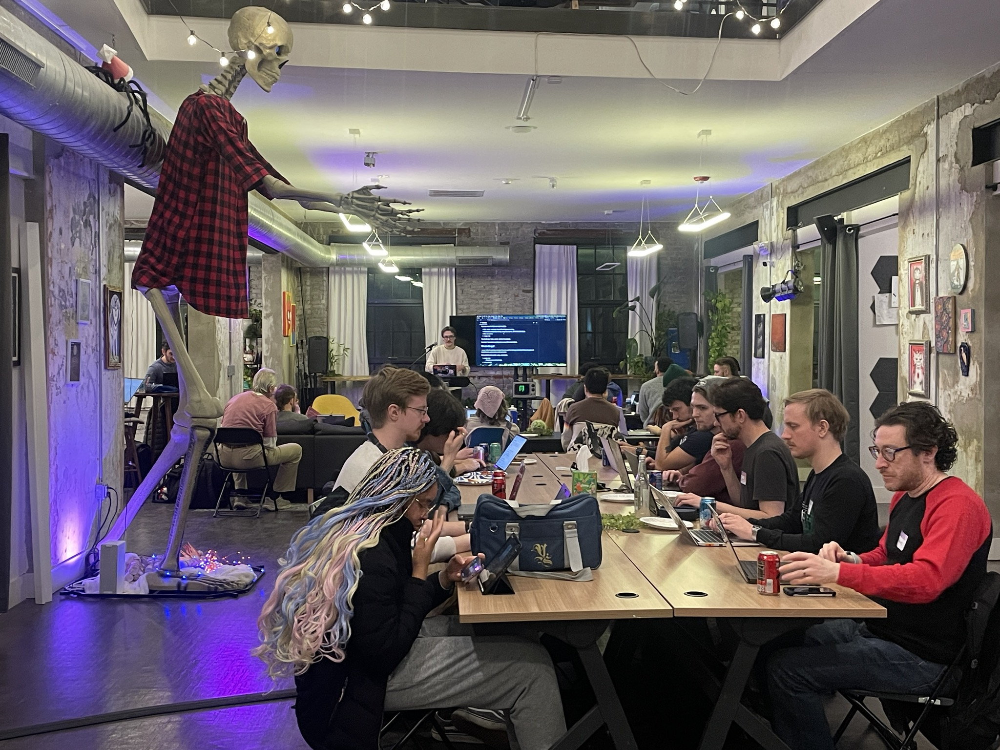
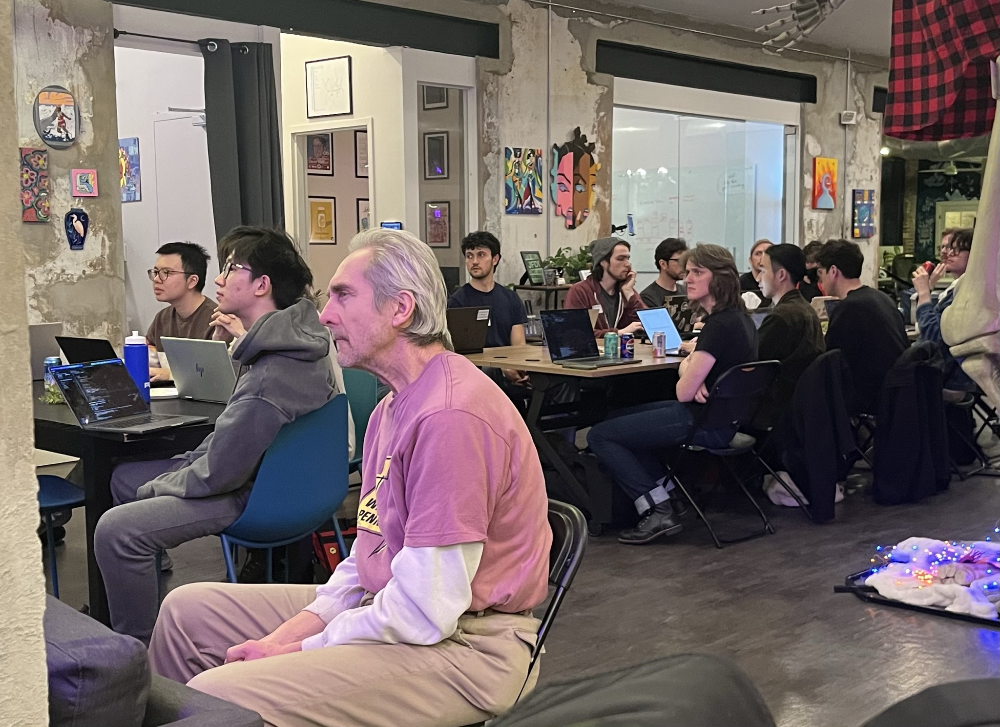

# February Recap

Sorry this one is a little late, I told [Taj](https://phlcode.club/organizers/taj)
I wanted to write this and I did _not_ follow through...

Either way, glad to see you!

## Announcements

- We got a new mascot!!

  

- PHL Code Club is proud to be collaborating in [The Big Meetup Mashup](https://indyhall.org/goodneighbors/),
  a hackathon at Indy Hall on Sunday March 15th. To put our money where our
  mouth is we gave out **_5 free tickets_**!
- We are also running a workshop on observability using OpenTelemetry at
  [Diversitech](https://diversitech.tribaja.co/). It's so exciting to share our
  knowledge with such a diverse crowd. Especially because also got free tickets
  to give out for this too!
- Our March event is live: [Hunting For Gems: Coding Challenges For Treasure Hunters](https://luma.com/lvjw5gri).
  This one is a collaboration with [Philly.rb](https://www.phillyrb.org/), the
  Philly Ruby Community! It will have a very similar format to
  [The Enchanted Codex](https://luma.com/8s6zbju2), which was basically a reskin
  of [Advent Of Code](https://adventofcode.com/). You won't want to miss this one
  as we will not only have exclusive stickers, but other prizes for the folks
  who finish the fastest or get the furthest.

## Event Recap

The February meetup was our first time hosting at [Indy Hall](https://indyhall.org/),
and boy was it a show! We had the wonderful [Ben Corey](https://benjamincorey.net/)
walk through some foundational Rust topics like the `Option` and `Result` types,
then we put that all together to build out own little HTTP client CLI, _curlrs_
(Pronounced _curlers_).

We also had one of our biggest turnouts yet! Thanks to everyone who came and
learned with us, it was great to see both new and familiar faces.

Looking forward to seeing everyone at the next one!

XoXo,

Graham
